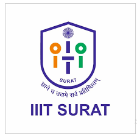

# 
Hi there!  I'm Rakesh Kumar Nayak

  

  

Made with 💜 by [Rakesh](https://https://www.linkedin.com/in/rakesh-kumar-nayak-7427661aa)

#   

  
  
  

 

## 🚀 Professional Profile
I am a **Data Science & AI/ML Researcher** currently pursuing my **M.Tech at IIIT Surat**. I specialize in building ethical, scalable, and impact-driven AI systems.

* 🎓 **GATE Qualified** in Computer Science & Engineering.
* 🚀 **Co-founder of AgriTek India**, revolutionizing agriculture with AI.
* 🏆 **Cultural Head** at NSS NCU & **Student Alexa Volunteer** at IEEE.

---
## 🎓 Education

<table>
<tr>
<td width="90">

</td>
<td>
<b>Indian Institute of Information Technology, Surat</b> 
M.Tech in Computer Science (AI/ML)
</td>
</tr>

<tr>
<td width="90">

</td>
<td>
<b>The NorthCap University (NCU)</b> 
B.Tech in Computer Science Engineering
</td>
</tr>
</table>

---
## 🧪 Featured Research & Projects

### 🌈 [Gender Inclusive Language Generation (LT-EDI @ ACL 2026)](https://github.com/Rakesh684-dot/LT-EDI-2026-Gender-Inclusive-Language)
*Advancing research in bias-free, inclusive language transformation.*
* **Objective**: Advancing state-of-the-art language models to generate gender-inclusive text by transforming biased input into neutral alternatives.
* **Multilingual Scope**: Developing robust solutions across **English, German, Spanish, Tamil, and Kannada**.
* **Technical Stack**: Fine-tuning **mT5** and **Flan-T5** architectures evaluated via the Gender Inclusive Fairness Index (GIFI).

 

### 🏥 [NLP-AI4Health: Medical Dialogue Summarization](https://github.com/Rakesh684-dot/Multilingual-Clinical-Summarization)
(https://aclanthology.org/2025.nlpai4health-main.8/)
*Published Research in ACL Anthology 2025*
* **Core Work**: Built a **RAG-based question-answering system** and multilingual medical dialogue summarization models using **mT5**.
* **Impact**: Focused on automating clinical documentation to improve healthcare efficiency through high-quality summarization of multilingual clinical conversations.

 

### 🚨 [AlertMate: IoT Fall Detection System](https://drive.google.com/file/d/1hOP6DqgtKytPrUdLKk6mpOd9llMxbdq4/view?usp=drivesdk)
[cite_start]*Smart wearable safety and notification system for elderly care.* [cite: 10]
* [cite_start]**3-Layer Architecture**: Integrated **Hardware** (Arduino Nano BLE 33), **Mobile** (Android), and **Cloud** (Firebase) layers[cite: 25].
* [cite_start]**Functionality**: Utilizes an **IMU sensor** to detect falls via free-fall and impact thresholds, instantly alerting caretakers via **Firebase Cloud Messaging (FCM)**[cite: 11, 30, 65].
* [cite_start]**Features**: Maintains fall history for medical analysis and provides real-time location tracking and manual SOS options[cite: 21, 22, 52].

 

### 🌾 AgriTek India (Co-Founder)
*Developing "AI for Agriculture" solutions to empower farmers.*
* **Mission**: Building sustainable agritech solutions that leverage **machine learning** to provide actionable, data-driven insights for optimized crop management.

---

## 🛠️ Tech Stack & Skills

  
  
  
  
  

---

## 📊 Activity & Contributions

  
  

  

---

## 📫 Connect with Me

